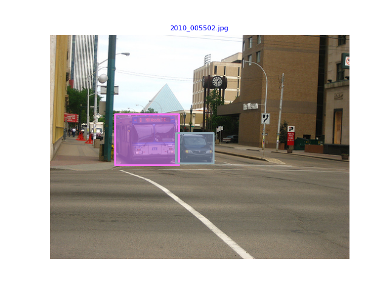

## 1 Introduction

### 1.1 Background: Object Detection
Object detection is one of the most essential tasks in computer vision.  This task aims to recognize and localize objects on 2D images. In this task, we provide five categories of objects, including cat, dog, bus, car, and bird. This mission focuses on solving the detection problem from a single image.

<div align="center">
  
</div>
<p align="center">
  Figure 1. An example of 2D Object Detection from the given dataset.
</p>


## 2 Setup

**Installing Python 3.8+**: To use python3, make sure to install version 3.8+ on your local machine.

**Virtual environment**: If you decide to work locally, we recommend using a virtual environment via anaconda for the project. If you choose not to use a virtual environment, it is up to you to make sure that all dependencies for the code are installed globally on your machine. To set up a conda virtual environment, run the following:

```bash
conda create -n retinanet python=3.8
conda activate retinanet
```

Install the PyTorch environment following the official instructions. Here we use PyTorch 1.10.1 and CUDA 11.3. This environment is valided on HKU GPU Farm Phase 2. You may also switch to another version by specifying the version number.

```bash
pip install torch==1.10.1+cu113 torchvision==0.11.2+cu113  -f https://download.pytorch.org/whl/torch_stable.html
```

Install other requirements:

```bash
pip install pycocotools
pip install tqdm
pip install scikit-image
```

## 3 Working on the task

### 3.1 Basic knowledge
Basic knowledge about object detection is necessary for completing the task. Please refer to the related papers (e.g., [Fast R-CNN](https://arxiv.org/abs/1504.08083), [YOLO](https://arxiv.org/abs/1506.02640)). You should also carefully read the paper of [RetinaNet](https://arxiv.org/abs/1708.02002).

### 3.2  Get Data and Code

The dataset is available [HERE](https://drive.google.com/file/d/1aJHCU-iAWJwqOizzYVhuHr6l_wPJWE_p/view?usp=sharing).  The dataset structure follows [COCO format](https://cocodataset.org/#format-data).


After downloading and extracting the dataset, you should put all files following the structure below:

```
└── Computer Vision-Object Detection
    ├── data
           ├── image                   # images
               ├── train
               ├── val
               └── test                
           ├── train.json              # train set annotation
           ├── val.json                # validation set annotation
           └── test.json               #  **test image ids with fake annotations**
    ├── retinanet                      # src code of retinanet
    ├── train.py                       # main script to train the model
    ├── test.py                        # main script to test the model
    ├── test_submission.py             #  final script for evaluation on test set 
    ├── vis.py                         # visualization script
    ├── plot.py                        
    └── README.md
```

### 3.3 Scripts

#### Train

```bash
python train.py --coco_path ./data --output_path ./output --depth 50 --epochs 20
```

#### Evaluation

Use this script to generate test set predictions for submission

```bash
python test.py --coco_path ./data --checkpoint_path ./output/model_final.pt --depth 50
```

or evaluate your model on validataion results
```bash
python test.py --coco_path ./data --checkpoint_path ./output/model_final.pt --depth 50 --set_name 'val'
```

#### Visualization

```bash
python vis.py
```

After downloading the test set, you should organize the files as the structure above and then run the evaluation command line to generate final json file. After generating final json file, you can use the script below to test the format of your results (Will be released with the test set). **We will not debug on format issues when do the final evaluation, which means you will lose full marks for the performance part if the format is not correct.**

```bash
python test_submission.py --coco_path ./data
```


## 4 Marking Scheme:

After evaluation, you will see a table like below. The number in first line is the result we will use for marking.

```
Average Precision  (AP) @[ IoU=0.50:0.95 | area=   all | maxDets=100 ] = 0.377
Average Precision  (AP) @[ IoU=0.50      | area=   all | maxDets=100 ] = xxx
Average Precision  (AP) @[ IoU=0.75      | area=   all | maxDets=100 ] = xxx
Average Precision  (AP) @[ IoU=0.50:0.95 | area= small | maxDets=100 ] = xxx
Average Precision  (AP) @[ IoU=0.50:0.95 | area=medium | maxDets=100 ] = xxx
Average Precision  (AP) @[ IoU=0.50:0.95 | area= large | maxDets=100 ] = xxx
Average Recall     (AR) @[ IoU=0.50:0.95 | area=   all | maxDets=  1 ] = xxx
Average Recall     (AR) @[ IoU=0.50:0.95 | area=   all | maxDets= 10 ] = xxx
Average Recall     (AR) @[ IoU=0.50:0.95 | area=   all | maxDets=100 ] = xxx
Average Recall     (AR) @[ IoU=0.50:0.95 | area= small | maxDets=100 ] = xxx
Average Recall     (AR) @[ IoU=0.50:0.95 | area=medium | maxDets=100 ] = xxx
Average Recall     (AR) @[ IoU=0.50:0.95 | area= large | maxDets=100 ] = xxx
```


## Reference

1. Focal Loss for Dense Object Detection. ICCV 2017 (Best Student Paper Award): [https://arxiv.org/abs/1708.02002](https://arxiv.org/abs/1708.02002)
2. Deep Residual Learning for Image Recognition. CVPR 2016 (Best Paper Award): [https://arxiv.org/abs/1512.03385](https://arxiv.org/abs/1512.03385)
3. Microsoft COCO: Common Objects in Context. ECCV 2014: [https://arxiv.org/abs/1405.0312](https://arxiv.org/abs/1405.0312)
